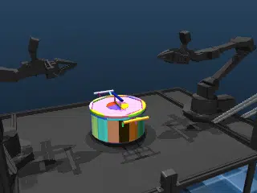
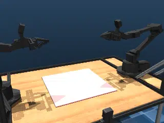
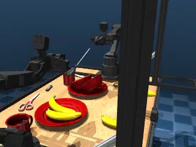

# Aloha

## Description

[ALOHA 2](https://aloha-2.github.io/) robot benchmarks testing different collision pipelines and object interactions on a workbench.

### aloha_pot

Lifting a pot off the work table.  This benchmark exercises MuJoCo Warp's convex mesh collision pipeline in a simple, single-object manipulation scenario.

The pot and lid are sourced from [PartNet](https://partnet.cs.stanford.edu/).

| Property | Value |
|----------|-------|
| Bodies | 26 |
| DoFs | 23 |
| Actuators | 14 |
| Geoms | 204 |
| Timestep | 0.002s |
| Solver | Newton |
| Friction | Elliptic |
| Integrator | Euler |
| Matrix Format | Dense |

### aloha_sdf

An SDF cow on the table.  This benchmark exercises [SDF](https://en.wikipedia.org/wiki/Signed_distance_function) queries in a simple, single-object manipulation scenario.

| Property | Value |
|----------|-------|
| Bodies | 22 |
| DoFs | 22 |
| Actuators | 14 |
| Geoms | 96 |
| Timestep | 0.002s |
| Solver | Newton |
| Friction | Elliptic |
| Integrator | Euler |
| Matrix Format | Dense |

### aloha_cloth

Cloth on a work table.  This benchmark exercises [MuJoCo deformable bodies](https://mujoco.readthedocs.io/en/stable/modeling.html#deformable-objects) in a workbench setting with many DoFs.

| Property | Value |
|----------|-------|
| Bodies | 921 |
| DoFs | 2716 |
| Actuators | 14 |
| Geoms | 95 |
| Timestep | 0.002s |
| Solver | CG |
| Friction | Pyramidal |
| Integrator | Euler |
| Matrix Format | Sparse |

### aloha_clutter

Full workbench scene with [YCB](https://www.ycbbenchmarks.com/) and [GSO](https://app.gazebosim.org/GoogleResearch/fuel/collections/Scanned%20Objects%20by%20Google%20Research) objects scattered on the table.  This benchmark exercises constraint islands and sleeping with many convex mesh pairs.

- 4 bananas
- 3 mugs
- 3 USB drives
- 2 bowls
- 2 plates
- 2 screwdrivers
- 2 scissors
- 2 magnifying glasses

Object assets sourced from [aloha_sim](https://github.com/google-deepmind/aloha_sim).

| Property | Value |
|----------|-------|
| Bodies | 42 |
| DoFs | 136 |
| Actuators | 14 |
| Geoms | 548 |
| Timestep | 0.002s |
| Solver | Newton |
| Friction | Elliptic |
| Integrator | Euler |
| Matrix Format | Dense |

