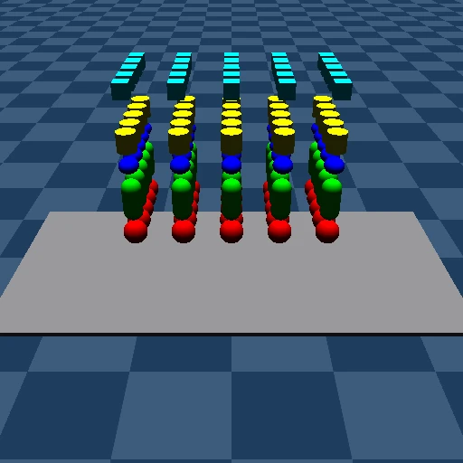

# Render

## Description

GPU ray-traced rendering of the [primitives](../../mujoco_warp/test_data/primitives.xml) scene. This benchmark measures rendering performance using a 5×5 grid of spheres, capsules, ellipsoids, cylinders, and boxes above a plane.

### primitives

| Property | Value |
|----------|-------|
| Bodies | 126 |
| DoFs | 750 |
| Geoms | 127 |
| Cameras | 1 |
| Resolution | 64×64 |
| Worlds | 8192 |

